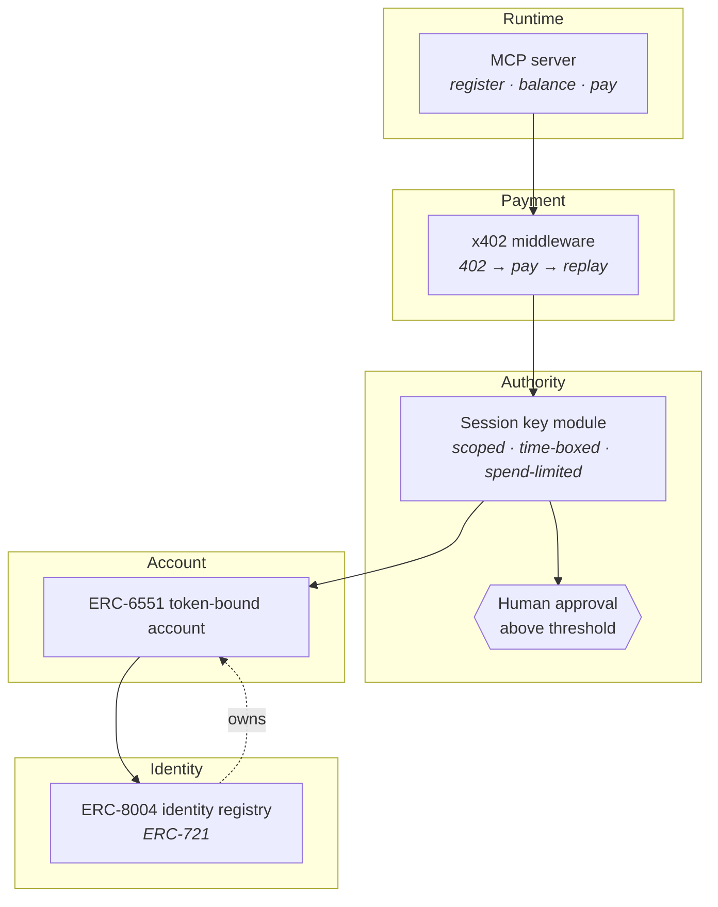

# agent-payments-reference

A worked example of an AI agent that has its own identity, its own wallet, and bounded
authority to spend from it.

Built from public standards. Nothing here is novel on its own — ERC-8004, ERC-6551, ERC-4337
and x402 all exist and all have reference implementations. What is missing is a clean example
of how they fit together, and what breaks when you try.

> **Status: in progress.** Architecture and decisions are written. Contracts are not.
> Deployed addresses go here when there are any.

## The problem

An agent that can pay for things needs signing authority. Hand it an ordinary private key and
you have given unbounded, permanent power to something whose behaviour you cannot fully
predict. That is the whole problem, and most agent demos skip it by holding the key
themselves.

Four questions have to be answered separately, and answering one does not answer the others:

| Question | Answered by |
|---|---|
| Who is this agent? | ERC-8004 identity registry |
| What owns its wallet? | ERC-6551 token-bound account |
| How much may it spend, and for how long? | Session-key module |
| How does it actually pay? | x402 over HTTP 402 |

## Architecture

The agent's identity NFT owns the account. Transfer the token and the wallet goes with it, in
one transaction, with no key handover. Authority is a module on top, so it can be narrowed or
revoked without moving funds.

## What this is not

- **Not a reimplementation of ERC-8004.** The reference contracts already exist at
  [erc-8004/erc-8004-contracts](https://github.com/erc-8004/erc-8004-contracts). This composes
  with them.
- **Not audited.** Not deployed to anything that holds real value beyond a demo.
- **Not a framework.** One worked path, written to be read.

## The unresolved part

A 6551 account is not a 4337 account. The 6551 spec never mentions 4337, so a bundler will not
touch the account until something implements `validateUserOp`. Three options, and the choice
is written up in [D-002](docs/adr/D-002-compose-not-reimplement.md) and
[D-001](https://github.com/Sanketbhandari/architecture-notes/blob/main/decisions/D-001-validateuserop-placement.md).

Current position: validation belongs in a module rather than in the account. That is reasoning,
not evidence, until the code exists.

## Decisions

Every non-obvious choice is recorded in `docs/adr/` with the alternatives that were rejected
and what would make it worth revisiting. Start with D-002.

## Running it locally

Nothing to run yet. This section gets filled in when the contracts land.

## License

MIT
